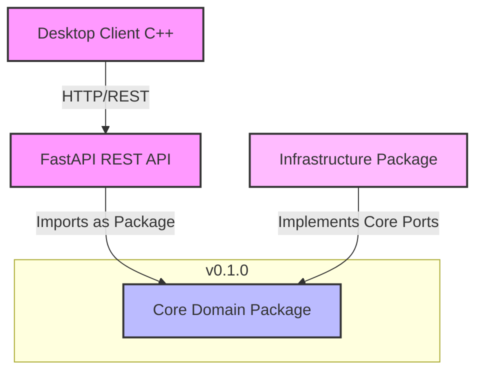

# 🏗️ Hobby Tracker — Core Domain (v0.1.0)


This repository contains the **pure business logic and domain core** for the Hobby Time Tracker application. The project is strictly designed using **Domain-Driven Design (DDD)** and **Clean Architecture** principles.

---

## 🎯 Functional Features (Business Capabilities)

The core encapsulates the domain logic for a granular, task-oriented time tracker. It protects invariants for two main aggregates: `Hobby` and `Activity` (Time Logs).

*   **Hobby Management:**
    *   Creating new hobbies with strict validation (e.g., unique names, metadata).
    *   Editing info & deleting hobbies
*   **Time Tracking & Logging:**
    *   Logging discrete `Activity` sessions linked to a specific hobby.
    *   **Strict Invariant Protection:** The core explicitly prevents recording activities with timestamps set in the future or overlapping sessions.
    *   High-performance time-sortable identification via `UUIDv7` for every entity.
*   **Analytics & Reporting (Read-Model Ready):**
    *   Aggregating raw log data to track total time spent per day, week, or month.
    *   Supplies structured data optimized for fast infrastructure queries and direct image generation.


---

## 🌟 Key Architectural Decisions

1. **Strict Domain Isolation:** The Core knows absolutely nothing about databases (SQLAlchemy), web frameworks (FastAPI), presentation layers, or charting libraries (Matplotlib). It contains only Aggregates, Entities, and Value Objects.
2. **Package-Based Architecture:** The core is treated as an independent Python package. Other infrastructure and presentation components import it as a third-party dependency via Git URL, ensuring clear boundaries.
3. **CQRS (Command Query Responsibility Segregation):** 
   * **Commands Layer:** Handled entirely by this Core package via Domain Aggregates to strictly protect business invariants.
   * **Queries Layer:** Bypasses the domain repositories and runs directly in the Infrastructure layer for maximum read performance and lightweight data mapping.
4. **Cutting-Edge Tech Stack:** Built with **Python 3.14** to leverage native, time-sortable high-performance identifiers via standard `uuid.uuid7()`.

---

## 🗺️ Dependency Flow & Component Map

The system components are completely decoupled. The Core acts as the single source of truth:



---

## 🛠️ Code Quality & Verification

The core domain guarantees absolute reliability through strict type safety and high test coverage.

Before committing, make sure all quality gates pass successfully:

* **Formatting & Linting (Ruff):**
  ```bash
  poetry run ruff check .
  poetry run ruff format .
  ```
* **Strict Static Typing (MyPy):**
  ```bash
  poetry run mypy src
  ```
* **Unit Testing (PyTest):**
  ```bash
  poetry run pytest
  ```

---

## 📥 Local Installation & Integration

To link this core package to your presentation or infrastructure layer during development, add it to your `pyproject.toml` via Git URL:

```toml
[project]
dependencies = [
    "hobby-tracker-core @ git+https://github.com/griy-rerere/hobby-tracker-core.git"
]
```

Or install it directly via pip:
```bash
pip install git+https://github.com/griy-rerere/hobby-tracker-core.git
```

## 📜 License

This project is licensed under the MIT License - see the LICENSE file for details.
